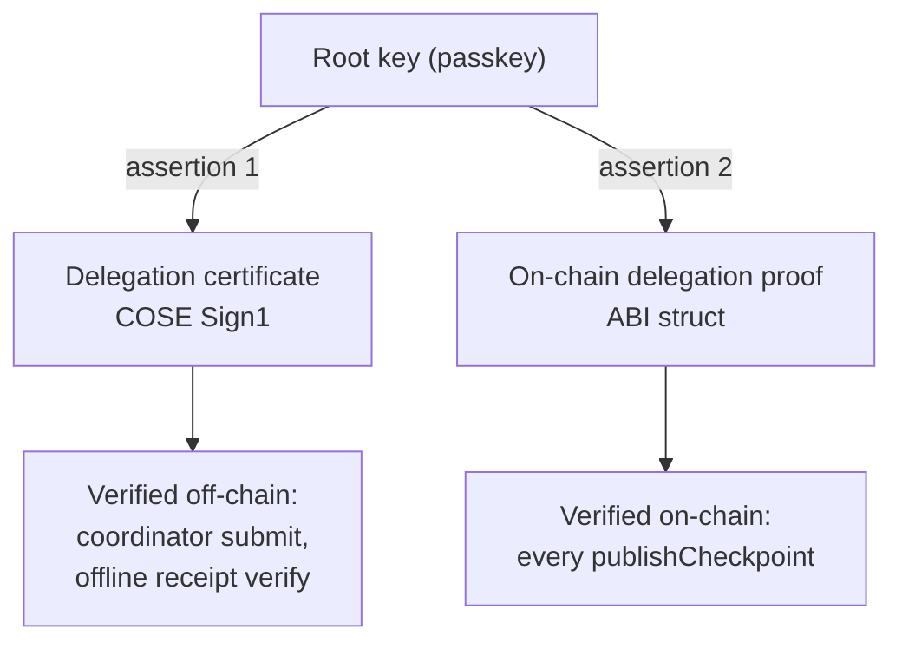

# Delegation proofs, certificates, and the WebAuthn assertion envelope

**Audience:** implementers of a Forestrie verifier or signer, and reviewers
assessing what a delegation actually proves.
**Related:** [receipt-trust-model.md](./receipt-trust-model.md) (question 2,
sealing attestation), [label-registry.md](./label-registry.md),
[key-custody-and-choice.md](./key-custody-and-choice.md),
[glossary.md](../glossary.md), and the univocity contract decisions
[ADR-0006](https://github.com/forestrie/univocity/blob/main/docs/adr/adr-0006-cose-shaped-delegation-proof.md) (COSE-shaped delegation
proof without on-chain certificate parsing) and
[ADR-0008](https://github.com/forestrie/univocity/blob/main/docs/adr/adr-0008-webauthn-assertion-delegation-alg.md) (the on-chain
algorithm, `algData`, and the policy band).

## Summary

A log's root key does not seal the log. It **delegates** sealing to a
short-lived key, and that delegation is the artifact every verifier and the
contract check. This document specifies the delegation artifacts and, in
particular, how a delegation signed by a **WebAuthn authenticator** — a
passkey — is carried, because an authenticator cannot produce an ordinary
COSE signature.

One delegation ceremony produces **two** root-signed artifacts with different
verifiers and different lifetimes. They are deliberately independent: each
carries its own authenticator assertion, so each verifies alone.

## 1. Why a passkey needs an envelope at all

A WebAuthn authenticator signs a fixed construction:

```
ECDSA_P256( authenticatorData ‖ SHA-256(clientDataJSON) )
```

The caller's message reaches the authenticator only through the `challenge`
member inside `clientDataJSON`. A COSE Sign1 verifier, by contrast, verifies
over `SHA-256(Sig_structure)`. Same curve, same hash, **different signature
envelope** — so a raw assertion will never verify as a plain COSE Sign1, and
the assertion material must travel with the artifact or the artifact cannot be
verified at all.

The resolution is an algorithm identifier that *means* "this signature is a
WebAuthn assertion", plus a place to carry the two assertion byte strings the
verifier needs to reconstruct what was signed.

### The security argument is the challenge binding

The assertion material is **not covered by the signature** — it sits in the
unprotected header, or in an ABI array. It is trustworthy only because the
challenge re-derives the tie to the artifact body. Every verifier rebuilds the
artifact's `Sig_structure` exactly as the plain ES256 path would, and then
requires

```
clientDataJSON.challenge == base64url( SHA-256( Sig_structure ) )
```

before verifying `P256( authenticatorData ‖ SHA-256(clientDataJSON) )` against
the root key. Without the challenge equality the assertion proves key
possession and says **nothing about this artifact**. `clientDataJSON.type`
must be `"webauthn.get"`, so a registration ceremony can never be replayed as
a delegation.

The two implementations reach that equality by different routes, and the
difference is deliberate:

| | How the challenge is compared | Why |
|---|---|---|
| **Off-chain** (TypeScript) | Parses `clientDataJSON` as JSON, compares the `challenge` member to the computed base64url string | A real JSON parser is free off-chain |
| **On-chain** (Solidity) | Byte-slices at a caller-supplied `challengeIndex` and compares against the literal JSON member text `"challenge":"` ‖ b64url ‖ `"` | Scanning JSON at Solidity gas prices is not free; the index is a hint, and comparing the full member text (quotes included) is what makes an unvalidated hint safe |

The on-chain form also byte-compares the 21-byte literal
`"type":"webauthn.get"` at a supplied `typeIndex`. Both indices are hints
only — a wrong hint fails the comparison, so they cannot be used to smuggle
anything.

## 2. Codepoints

### The algorithm

`ALG_ES256_WEBAUTHN` is a COSE **algorithm** identifier: an ES256 key whose
signature is a WebAuthn assertion. A verifier that does not know it must reject
it as an unknown algorithm and must never fall back to a plain ES256 verify —
which is precisely why it is a distinct algorithm rather than ES256 plus a
flag.

### The envelope label — `TBD1`

The place the assertion rides off-chain is a COSE **header parameter**. This
document names it **`TBD1`**, in the IETF convention for a codepoint whose
assignment is not settled.

The header parameter and the algorithm share the number `-65800`. It is not a
wire ambiguity — the algorithm appears as a *value* under protected label `1`,
the envelope as a *key* in the unprotected map, and the two never collide at
a parse position — but it is a defect, and
[label-registry.md](./label-registry.md) §4 states its cost and the intended
separation: `TBD1` is the envelope, and the algorithm keeps the number it has.

The values, their registry status, and every other codepoint are in
[label-registry.md](./label-registry.md); implementations use the numbers
there.

## 3. The two artifacts of one ceremony



**Two assertions, not one.** A single assertion's challenge can bind only one
`Sig_structure`. Sharing one would make each artifact's validity depend on
material carried by the other, so the certificate would stop being
independently verifiable offline — which is the product property. The cost is
two authenticator gestures per ceremony, accepted at the roughly six-hourly
lease cadence and surfaced in the UI rather than hidden.

### 3.1 Same facts, two different payload encodings

Both artifacts bind the same facts — *this root delegates to this key, for
this log, over this MMR range* — but they **do not share a payload encoding**,
and the two must not be confused.

| | On-chain delegation proof | Delegation certificate |
|---|---|---|
| Payload | Packed binary, domain-prefixed (§4.1) | CBOR map with integer labels (§5.1) |
| Protected header | Hardcoded `{1: -7}` on the plain path | `{1: alg, 3: cty, 4: kid}` |
| Carries a lease expiry | No — bounded by MMR range only | Yes — `issuedAt` / `expiresAt` |
| Verified by | The contract, at every publish | Coordinator submit, and any offline holder |

What they share is the *scope*: a delegation is bound to **one log and one MMR
range**, and that is what bounds a compromised sealer — it can seal within its
lease and nothing else.

## 4. The on-chain delegation proof

An ABI struct, not COSE — the contract never parses COSE for the proof.

| # | Field | Type | Notes |
|---|---|---|---|
| 0 | `protectedHeader` | `bytes` | The COSE protected header; the algorithm is extracted from it |
| 1 | `delegationKey` | `bytes` | The delegated (sealing) public key |
| 2 | `mmrStart` | `uint64` | Inclusive lower bound of the lease |
| 3 | `mmrEnd` | `uint64` | Inclusive upper bound |
| 4 | `signature` | `bytes` | Raw 64-byte P1363 `r ‖ s`, low-s normalised — never a container |
| 5 | `algData` | `bytes[]` | Algorithm-specific material; empty for every algorithm that defines none |

`algData` is the generic escape hatch: a per-algorithm array that is **empty
unless the algorithm defines contents**. Presence of the field is not presence
of data.

### 4.1 The signed payload

The proof's payload is packed binary, prefixed with a signing domain:

```
payload = "forestrie.univocity.delegation.v1"   (33 bytes, ASCII, no length prefix)
        ‖ logId            (32 bytes)
        ‖ mmrStart         (8 bytes, big-endian uint64)
        ‖ mmrEnd           (8 bytes, big-endian uint64)
        ‖ delegatedKeyX    (32 bytes)
        ‖ delegatedKeyY    (32 bytes)
                            = 145 bytes total
```

The domain string prevents a signature over one Forestrie construction being
replayed as another. The `Sig_structure` wrapping this payload uses a
hardcoded ES256 protected header on the plain path; the WebAuthn path takes the
algorithm from the proof's own `protectedHeader` field.

`logId` is a 16-byte UUID carried in a 32-byte field. **It occupies the low 16
bytes** — the value is left-padded. (A comment in the Solidity leaf-encoding
library describes this as "right-padded"; every producer left-pads, the hashes
agree, and the comment is simply inverted. Do not follow the comment.)

### 4.2 `algData` under `ALG_ES256_WEBAUTHN`

Exactly three elements, in this order. Any other count is rejected.

| Index | Contents | Constraint |
|---|---|---|
| 0 | `authenticatorData` | at least 37 bytes |
| 1 | `clientDataJSON` | — |
| 2 | packed indices | exactly 16 bytes |

The packed indices element is:

```
bytes  0..7   challengeIndex   (big-endian uint64)
bytes  8..15  typeIndex        (big-endian uint64)
```

Challenge index first. These exist only to avoid scanning JSON on-chain; the
off-chain envelope deliberately omits them (§5).

### 4.3 On-chain verification order

1. Algorithm in the protected header must be `ALG_ES256_WEBAUTHN`.
2. `signature` must be exactly 64 bytes.
3. A root key must be set.
4. The checkpoint's MMR index must lie within `[mmrStart, mmrEnd]`.
5. Decode `algData` (the three-element shape above).
6. Read the flags byte at `authenticatorData[32]`, immediately after the
   32-byte rpIdHash.
7. **User presence** (`0x01`) — always required.
8. **User verification** (`0x04`) — required only when the governing grant
   sets the policy flag.
9. **Backup flags** — a credential marked backed-up (`BS`, `0x10`) without
   being backup-eligible (`BE`, `0x08`) is rejected as incoherent.
10. **rpIdHash** — compared only when a non-zero pin is supplied. See §6.
11. **Ceremony type** — the 21-byte literal `"type":"webauthn.get"` at
    `typeIndex`, bounds-checked.
12. Build the 145-byte payload (§3.1) and the `Sig_structure`; hash it.
13. **Challenge binding** — the JSON member text at `challengeIndex` must equal
    `"challenge":"` ‖ base64url(hash) ‖ `"`, bounds-checked.
14. Verify `P256( authenticatorData ‖ SHA-256(clientDataJSON) )` against the
    stored root coordinates.

### 4.4 The algorithm is for delegation only

**`ALG_ES256_WEBAUTHN` is never accepted as a checkpoint-signing algorithm.**
Verified in source: checkpoint signature dispatch admits exactly `ALG_ES256`
and `ALG_KS256` and reverts on anything else; the WebAuthn algorithm is
compared only in the delegation path. A passkey authorises a sealer; it never
seals.

Relatedly, a KS256 checkpoint rejects delegation outright — that path reverts
if a delegation signature is present at all.

## 5. The delegation certificate (off-chain)

A COSE Sign1 by the root key, verified at coordinator submit and — the product
claim — offline, forever, by any holder. It is an **untagged** 4-element Sign1
array.

### 5.1 Protected header and payload

Protected header:
`{1: alg, 3: "application/forestrie.delegation+cbor", 4: kid}`.

Payload is a CBOR map with integer labels — note there is **no label 2**:

| Label | Field | Type | Notes |
|---|---|---|---|
| 1 | `log_id` | tstr (hex) | encoders MAY omit when empty |
| 3 | `mmr_start` | uint | inclusive; encoders MAY omit when `log_id` is omitted |
| 4 | `mmr_end` | uint | inclusive; encoders MAY omit when `log_id` is omitted |
| 5 | `delegated_key` | COSE_Key map | `{1: 2 (EC2), -1: 1 (P-256), -2: x, -3: y}` |
| 6 | `constraints` | map | always present, `{}` when none |
| 7 | `schema_ver` | uint | always `1` |
| 8 | `issued_at` | uint, unix seconds | encoders MAY omit when zero |
| 9 | `expires_at` | uint, unix seconds | encoders MAY omit when zero |
| 10 | `delegation_id` | bstr | |

Decoders MUST accept both the omitting and the always-present forms.

The signature is exactly 64 bytes, IEEE P1363 `r ‖ s`.

Two different CBOR canonicalisations are in play across the system: the
certificate builder uses core-deterministic ordering (RFC 8949 §4.2) while the
checkpoint envelope uses the older length-first canonical ordering. They agree
byte-for-byte only while every map label is single-byte — and the checkpoint
envelope carries multi-byte labels. No failure has been observed; it is
recorded because the divergence is latent.

### 5.2 The WebAuthn envelope

For a certificate whose protected-header algorithm is `ALG_ES256_WEBAUTHN`:

- The **unprotected** header carries, at `TBD1`, a **2-element** CBOR array
  `[authenticatorData, clientDataJSON]`.
- `signature` stays the raw 64-byte P1363 `r ‖ s`, low-s normalised.
- The envelope sits in the unprotected header so `Sig_structure` stays
  canonical and the payload hash is unaffected.

**No index hints.** Unlike the on-chain `algData`, the envelope carries no
`challengeIndex`/`typeIndex` third element. The indices exist on-chain purely
as a gas workaround; an off-chain verifier parses `clientDataJSON` properly,
and carrying hints would only create a consistency obligation — verify them or
deliberately ignore them — with nothing gained.

## 6. Policy: user presence, user verification, origin pinning

| Check | Rule | Where the policy lives |
|---|---|---|
| **User presence** | Always required | Constant |
| **User verification** | Required if and only if the governing grant sets `GF_REQUIRES_USER_VERIFICATION` | The grant, committed in the parent auth log |
| **Origin (`rpIdHash`)** | Verifier supports pinning; enabled by a non-zero pin | Intended to use the same grant-flag channel; see [implementation-status.md](./implementation-status.md) |

Putting user-verification policy in the grant rather than in the verifier is
the load-bearing choice: the authority states the requirement once, at
issuance, in an artifact that is transparency-logged, and the chain, the
admission edge and offline verifiers all read the same declaration. Some
deployments want a biometric per signature; kiosks, accessibility cases and
long-running agent sessions do not. A constant in the verifier could not serve
both.

There is one accepted asymmetry: a verifier holding only a bare certificate,
with no grant in evidence, cannot evaluate the flag. The on-chain verifier
backstops it at publish.

**Origin pinning is a verifier capability without a policy channel.** The
design intent is for it to become per-log policy over the same grant-flag
channel as user verification. Whether a deployment enables it, and the
consequence for the rpId-mismatch error, are in
[implementation-status.md](./implementation-status.md).

## 7. Fail-closed rules

These hold in every implementation and in both directions.

1. **Unknown algorithm is rejected.** A verifier that does not implement
   `ALG_ES256_WEBAUTHN` rejects it — it never attempts a plain ES256 verify.
2. **Missing or malformed envelope under the WebAuthn algorithm is a
   verification failure**, never a fallback to plain verify.
3. **An envelope entry in the unprotected header is rejected under any other
   algorithm.** Algorithm-specific material under an algorithm that defines
   none is evidence of confusion, never something to ignore.

   The rule is scoped to the **unprotected header**, which is where both
   off-chain implementations look and the only place the envelope is ever
   written. It applies to *every* other algorithm — plain ES256, KS256, and
   algorithms the verifier does not implement — and the check runs **before**
   any signature work, so an unsupported algorithm carrying an envelope is
   still refused for the envelope. Off-chain this is
   `unexpected_webauthn_envelope`; on-chain it is a revert on non-empty
   `algData`, likewise applied before the ES256 verify.

   A verifier that also inspected the *protected* header for a stray envelope
   entry would be free to do so, but neither implementation does, and a
   protected-header entry would in any case change the `Sig_structure` and so
   fail the signature. The unprotected header is the only slot where the
   material can ride undetected, which is exactly why the rule lives there.
4. **Policy flags must be consumed by the algorithm.** If the grant sets bits
   in the algorithm-policy band that the supplied algorithm does not consume,
   the publish reverts. Only `ALG_ES256_WEBAUTHN` consumes the
   user-verification bit; the remaining seven bits of the band always revert.
   A stated policy can therefore never be silently dropped.
5. **No delegation means no policy and no `algData`.** If the proof carries no
   signature, any set policy bit or any `algData` element reverts.
6. **Low-s is enforced.** A high-s signature is rejected; without this a
   verifier would accept the malleable twin of a valid signature.

## 8. Who can parse what

| Component | Delegation proof (`algData`) | Certificate envelope (`TBD1`) | Notes |
|---|---|---|---|
| The contract (Solidity) | **Yes** — verifies it at every publish | No | Never sees the certificate |
| The TypeScript admission and verification libraries | Builds it | **Yes** — builds and verifies | The verification chokepoint at admission and for offline holders |
| The browser client | Builds it | Builds it | Produces both assertions of the ceremony |
| The Go operator services — publish path | **Decodes and forwards** `algData` into calldata | No | Names the algorithm and the envelope label as constants |
| The Go operator services — on-chain-proof builder | **Cannot produce one.** It never sets `algData`, so it emits plain ES256 proofs only | No | The WebAuthn form is built browser-side |
| The Go operator services — sealer | n/a | **Yes** — verifies the certificate under the algorithm it declares | See below |

**The sealer reads the declared algorithm.** Before sealing, the sealer
verifies the delegation certificate under the algorithm in its protected
header: plain ES256, KS256, or `ALG_ES256_WEBAUTHN` with the envelope. An
algorithm it does not implement is named in the error rather than verified as
something else, and a stray envelope under any other algorithm is refused
before signature work (rule 3 in §7).

**`ALG_ES256_WEBAUTHN` is a signature algorithm, not a key type.** A passkey
root is an ordinary 64-byte P-256 point, advertised as ES256 by every
trust-root resolver; only the certificate's *signature envelope* is WebAuthn.
A trust root is never advertised as `-65800`.

## 9. Test vectors

A single real-authenticator capture is the cross-implementation anchor: one
genuine gesture, exercised by the Solidity, Go and TypeScript verifiers. The
fixture is **byte-identical in all three repositories**, verified by digest.
That is the cross-implementation evidence that the three verifiers agree about
what a delegation assertion is.

The fixture exposes `challengeIndex` and `typeIndex` as separate JSON fields
rather than as the packed 16-byte `algData[2]` blob, so a consumer must pack
them itself. That is an encoder-side convention, not a disagreement.

It carries **two** sections: `onchain` (the delegation proof) and
`certificate`. The certificate section holds a complete wire-format COSE Sign1
— including the unprotected map with the 2-element envelope — plus the
`Sig_structure` and the expected challenge, so a verifier can assert byte
equality rather than merely "it verified".

## Open questions

- **`TBD1` needs a real assignment** distinct from the algorithm's number
  (§2), and the shipped constants need to stop aliasing.
- **Origin pinning has no policy channel** (§6).
- **A single-gesture ceremony** — one assertion whose challenge binds a digest
  covering both artifacts — would halve the gesture cost. It is deliberately
  not attempted, because it re-couples the two artifacts' verification and
  reopens the offline story for the certificate. Worth revisiting only if lease
  cadence shortens materially; it would need its own binding construction.

## References

- [label-registry.md](./label-registry.md) — all codepoints in one table.
- [key-custody-and-choice.md](./key-custody-and-choice.md) — why a passkey is
  the root, and what else can be.
- [checkpoints-and-receipts.md](./checkpoints-and-receipts.md) — what the
  delegated key goes on to sign.
- [ADR-0064](../decisions/adr-0064-passkey-session-key-endorsement.md) — the
  custody split that reuses this envelope for the session-key endorsement.
- univocity [ADR-0008](https://github.com/forestrie/univocity/blob/main/docs/adr/adr-0008-webauthn-assertion-delegation-alg.md) (the
  on-chain algorithm, `algData`, the policy band) and
  [ADR-0006](https://github.com/forestrie/univocity/blob/main/docs/adr/adr-0006-cose-shaped-delegation-proof.md) (COSE-shaped
  delegation proof without on-chain certificate parsing).
