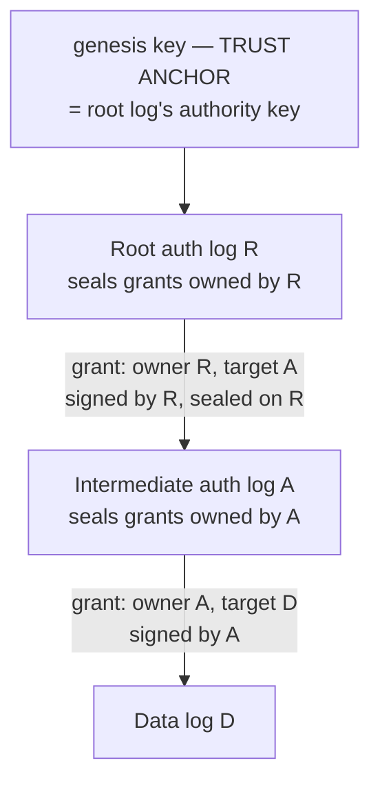

# Log authority and the grant

**Audience:** implementers of a Forestrie client or verifier, and reviewers
tracing where a log's authority comes from.
**Related:** [receipt-trust-model.md](./receipt-trust-model.md)
(question 3, authority),
[ARC-0019](../decisions/arc-0019-grant-verification-model.md) (the accepted
grant verification model),
[label-registry.md](./label-registry.md),
[checkpoints-and-receipts.md](./checkpoints-and-receipts.md),
[glossary.md](../glossary.md).

## Summary

A Forestrie log has no owner record, no access-control list, and no registry
entry. Its authority **is** a signed artifact whose inclusion in its parent log
is provable — a **grant**. This document specifies the grant's wire format, the
commitment the chain holds, and the rules that make one grant unable to
impersonate another.

The single invariant the model follows from:

> A grant is **signed by the authority of its owner**, and **establishes the
> authority key for its target**.

Everything else follows from applying that recursively.

## 1. One anchor, a chain of delegations

There is exactly one trust anchor per forest: the **genesis** key, which is
also the authority key of the root log. Every other log's authority is a
signed, sealed delegation from its parent.



The **forest genesis document** is **not** a per-log artifact. It is the
instance registration document, recording the bootstrap key bound into the
contract at deploy — one per forest, not one per log. Reaching the anchor
from a child log means walking this hierarchy, not reading a per-log genesis.

**The contract does that walk at publish.** It re-checks the presented grant's
inclusion in the parent log against the parent's on-chain accumulator, within
the grant's size bounds, link by link to the bootstrap key. This is why state
read from the chain carries the authority answer with it.

### 1.1 The forest genesis document

A CBOR map with integer labels, in Core Deterministic Encoding, written once
when the forest's contract instance is deployed and served immutably. It is
the signature root a verifier holds when it holds nothing else, and its
contents are what the contract's constructor bound.

| Label | Field | Type | Rule |
|---|---|---|---|
| `-68009` | schema version | uint | Must be `2` |
| `-68014` | bootstrap key algorithm | int | `-7` (ES256) or `-65799` (KS256) |
| `-68015` | bootstrap public key | bstr | 64-byte `x‖y` under ES256; 20-byte address under KS256 |
| `-68011` | contract address | bstr, 20 bytes | The instance the forest anchors to |
| `-68013` | chain id | tstr | Decimal EIP-155 chain id |
| `-68010` | root log id | bstr, 32 bytes | Optional; when present must equal the forest's root authority log id in padded wire form |
| `-68016` | contract variant | tstr | Optional; present only when the instance is not the immutable variant |
| `-68017` | deployer | bstr, 20 bytes | Required exactly when `-68016` is present |

A decoder rejects a version other than `2`, an algorithm other than the two
above, a key whose length does not match the algorithm, and the retired label
`-68012`. The chain binding — `(chain id, contract address)` — is what ties a
receipt's forest to one contract instance; the bootstrap key is the root log's
authority key. Display names and declaration sites are in
[label-registry.md](./label-registry.md) §2.3.

### 1.2 `logId` versus `ownerLogId`

Two identifiers, easily conflated:

- **`logId`** — the log this grant *authorises*. The target.
- **`ownerLogId`** — the log whose authority *issued* it. The owner.

The grant's own COSE envelope is verified against the **owner's** authority
key. The `grantData` it carries becomes the **target's** authority key. These
are structurally distinct keys and collapsing them is a forgery vector — never
verify the grant envelope against `grantData`.

## 2. Wire format

### 2.1 The inner grant

A CBOR map with integer keys, verified against the codec.

| Key | Field | Wire type | Notes |
|---|---|---|---|
| `0` | `idtimestamp` | bstr, 8 bytes | **Response format only** — never present in the signed payload |
| `1` | `logId` | bstr, 32 bytes | The 16-byte UUID occupies the **low** 16 bytes |
| `2` | `ownerLogId` | bstr, 32 bytes | Same padding |
| `3` | `grant` (flags) | bstr, left-padded to 8 bytes | §3 |
| `4` | `maxHeight` | uint | Entry ceiling |
| `5` | `minGrowth` | uint | |
| `6` | `grantData` | bstr | The target's authority key |

**Keys `7` and `8` are rejected on sight** in both the payload and response
decoders. They carried a legacy `signer` and `kind`; `grantData` is now the
sole statement-signer binding, and accepting the removed fields would
reintroduce exactly the ambiguity their removal eliminated.

### 2.2 `grantData` shapes

| Root algorithm | `grantData` | Binding derivation |
|---|---|---|
| KS256 | 20-byte Ethereum address | The full 20 bytes |
| ES256 | 64-byte P-256 `x‖y` | The first 32 bytes (the x coordinate) |
| Custodian (KMS bootstrap) | 16-byte kid | The full 16 bytes |

Under passkey custody the ES256 `grantData` **is the passkey's public key** —
the same coordinate pair the contract binds as the log's root key, and the same
anchor the session-key endorsement verifies under.

### 2.3 The transparent statement wrapper

A completed grant is a COSE Sign1 whose payload is the SHA-256 of the inner
grant, with the grant itself and its proof of inclusion carried alongside:

| Label | Header | Contents |
|---|---|---|
| `-65538` | Unprotected | The full inner grant bytes |
| `-65537` | Unprotected | The assigned idtimestamp |
| `396` | Unprotected | The inclusion receipt |

This is why a sealed grant is **self-authenticating**: it carries its own
proof, so a verifier needs nothing from the operator to check it.

## 3. Flags

The `grant` field is a `uint256` on-chain and an 8-byte big-endian value on the
wire. Bit *n* maps to wire byte `7 - (n div 8)`, mask `1 << (n mod 8)` — so
bit 40 is **wire byte 2, mask `0x01`**.

| Bits | Meaning | Enforced |
|---|---|---|
| 0–1 | Log kind: auth log, data log | Chain |
| 32–34 | `CREATE`, `EXTEND`, `DERIVED` | Chain |
| 35 | `GF_CHILD_PAYMENT_REQUIRED`: the operator requires payment before registering a child grant | The operator's registration API — never the chain, never a verifier |
| 36–39 | Operator-assignable derived band | **Convention only** — no on-chain constant, no mask, no test |
| 40–47 | Algorithm policy. Bit 40 requires user verification | Chain, fail-closed |
| 224–255 | Request codes | Not committed |

Two properties matter more than the individual bits.

**Policy travels in the data, not in configuration.** A requirement stated in
the grant is committed in the parent auth log, and the contract, the admission
edge and offline verifiers all read the same declaration. A constant compiled
into a verifier could not serve deployments that legitimately differ — a
biometric per signature suits one product and breaks a kiosk or a long-running
agent session.

**The algorithm-policy band is fail-closed.** If a grant sets a band bit the
supplied delegation algorithm does not consume, the publish reverts. Bits 41–47
are unallocated and always revert. A stated policy can therefore never be
silently dropped, which is the property that makes it safe to put policy in the
grant at all.

## 4. The commitment

The chain does not store grants. It stores a commitment, and the log stores a
leaf:

```
inner       = logId(32) ‖ grant(32) ‖ maxHeight(8) ‖ minGrowth(8)
                        ‖ ownerLogId(32) ‖ grantData(variable)

commitment  = SHA-256( idtimestamp(8, big-endian) ‖ SHA-256( inner ) )
```

Three properties of the commitment to note:

- **The flags widen.** `grant` is 8 bytes on the wire and **32 bytes** in the
  commitment preimage. The request-code band in the high bits is therefore
  outside the wire representation and outside the commitment.
- **The request code is excluded.** It is a transport concern, not a committed
  fact.
- **Field order is not the CBOR key order.** The preimage order is
  `logId, grant, maxHeight, minGrowth, ownerLogId, grantData`; the CBOR keys
  run `logId, ownerLogId, grant, maxHeight, minGrowth, grantData`. There is no
  reason to expect them to match, and they do not.

Because the commitment covers *fields*, not the object, a grant's unprotected
header is neither committed nor authority-signed. That is a deliberate property
with a real consequence: it is why an endorsement could technically have been
carried there, and why it was not — see
[the endorsement document](./leaf-admission-and-session-endorsement.md).

## 5. Verifying a grant

Three checks, none substitutable for another. Each blocks a different forgery;
collapsing any two opens replay or substitution.

| # | Check | Against |
|---|---|---|
| 1 | **Receipt inclusion** — the grant is in its parent log | The parent's accumulator |
| 2 | **Envelope signature** — the grant was issued by the owner | The **`ownerLogId` authority key** or its delegate |
| 3 | **Signer binding** — the entry was signed by the key the grant names | `kid` equals the binding derived from `grantData` |

Check 2 uses the *issuance* key. Check 3 uses the *endorsed signer* key. They
are different keys with different roles, and the single most important rule
here is that the grant envelope is **never** verified against `grantData`.

For a statement-registration grant, the flags must additionally mark it as one
— a data log with extend authority. A grant of the wrong shape is refused
before its signature is considered.

## 6. Credential versus evidence

Opening a data log under an intermediate authority involves two grants. They
are not two authorisations; one is a credential and the other is context.

| | Child grant | Parent grant |
|---|---|---|
| What it is | The signed assertion "owner authorises target", and the new resource | The issuer's certificate plus its inclusion receipt |
| Carries authority? | **Yes, until it is sealed** — its signature proves possession of the owner's private key, and until the grant has a receipt nobody else can produce it. Once sealed it is as public and replayable as any other grant | **No** — public and replayable; its receipt is published. Possession conveys nothing |
| Transport | The `Authorization` header | The request body |

The parent grant sits in the body precisely *because* it is not a credential.
Putting a public, freely-copyable artifact in `Authorization` would
misrepresent what it is.

This shape exists because a **creation** grant has no receipt yet — it is being
submitted to be sealed — so it cannot be authenticated by inclusion. It is
authenticated by its signature under the owner's key, and the service holds no
grant store, so the caller must present the parent for that key to be
recoverable. The presented parent is re-verified, never trusted.

Every other case needs one grant: a root-owned log chains directly to the
anchor, and a steady-state registration grant is already sealed and carries its
own receipt.

## 7. What a grant does and does not do

- **Grants are irrevocable.** `maxHeight` is a contract-enforced entry ceiling
  — a high-water mark, not a decrementing balance. Capacity ends by exhaustion
  or by a parent declining to renew, never by revocation. That irrevocability
  is what makes a performer's evidence unsuppressable by whoever paid for it.
  Two limits on that sentence, both easy to overstate:
  - It is unsuppressable **by the payer**. The operator who holds the sealing
    lease is a different party with different powers — see
    [trust-boundaries-and-operator-powers.md](./trust-boundaries-and-operator-powers.md),
    which is the document that bounds them.
  - **The ceiling bounds the log, not an issuer.** `maxHeight` is compared
    against the log's size, and a log's entries may come from a succession of
    signers over its life. So two grants over one log do not sum — the larger
    ceiling simply subsumes the smaller — and nothing on-chain records *whose*
    capacity a given entry consumed. A design that needs "this signer may add
    *n* entries" cannot express it with a publish grant, and must either give
    the work its own log or carry the allowance as a derived policy enforced at
    admission (§3, "policy travels in the data").
- **Authority is forward-only.** A parent may decline future growth. It cannot
  rewrite, censor, or sign in a child's place. A frozen child re-anchors under
  its own root.
- **Submission is permissionless.** Authority is a valid grant inclusion proof
  plus a correctly signed consistency receipt. The contract does not check who
  submitted the transaction, so no operator can censor or stall a well-formed
  write, and proof of authority is portable rather than identity-held.
- **A grant is presented, not spent.** The contract keeps no record of the
  grants it has accepted: its per-log state is the accumulator and the size,
  and the grant's idtimestamp is emitted in the event, never stored. A sealed
  grant with extend authority can be presented with every later checkpoint of
  its log, which is what authorising the log rather than one publish means.
- **Payment is a separate plane.** A grant is a prepaid provability
  entitlement: the requester of work buys capacity and the performer draws it
  down. Payment identity is never an input to grant verification, and grants
  never gate payment. Coupling them would let a lapsed payment silently revoke
  authority. One parent flag, bit 35, lets the operator's registration API
  require payment before it registers a *child* grant; that is a gate on
  registration at the operator, committed in the parent's leaf and invisible
  to the contract and to verifiers.

## Open questions

- **Bits 35–39 are reserved by comment only.** No mask, no constant, no test
  asserts the algorithm band stays clear of them. A future widening of the
  algorithm band downward would break the reservation silently.

Which verifiers implement the off-chain grant-chain walk, and the state of the
Solidity leaf-encoding library's padding comment, are recorded in
[implementation-status.md](./implementation-status.md).

## References

- [receipt-trust-model.md](./receipt-trust-model.md) — how authority sits
  among the four trust questions.
- [ARC-0019](../decisions/arc-0019-grant-verification-model.md) — the three
  verification obligations in full, with the pseudocode.
- [vectors/grant-and-leaf-format.md](../vectors/grant-and-leaf-format.md) — the
  leaf commitment with cross-language vectors.
- [label-registry.md](./label-registry.md) — the CBOR keys and flag bands.
- [leaf-admission-and-session-endorsement.md](./leaf-admission-and-session-endorsement.md)
  — how `grantData` anchors an endorsed signer.
- [key-custody-and-choice.md](./key-custody-and-choice.md) — what holds the
  key `grantData` names.
