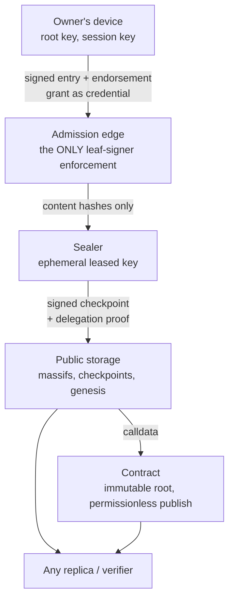

# Trust boundaries, and what the operator can and cannot do

**Status:** LIVE
**Date:** 2026-08-30
**Audience:** relying parties, security reviewers, and anyone assessing what
trusting a Forestrie operator would actually mean.
**Related:** [receipt-trust-model.md](./receipt-trust-model.md),
[key-custody-and-choice.md](./key-custody-and-choice.md),
[glossary.md](../glossary.md).

## Summary

Forestrie's design goal is not that the operator is honest. It is that the
operator's honesty **does not need to be assumed** for the record to mean
something. This document states where the boundaries are, what crosses them,
what an operator can still do, and — the part usually left vague — what it
cannot do and what it can do that we have not prevented.

The short version: an operator can **decline to act**, and that is visible. It
cannot forge, rewrite, re-root, equivocate, or make any of those survive
contact with a verifier.

## 1. The parties

Two distinct operators are routinely collapsed into one, and the distinction is
load-bearing: the strongest attacks require them to **collude**.

| Party | Role | Holds |
|---|---|---|
| **The log owner** (user) | Owns the log's root authority | The root key, in one of the custody shapes |
| **Transparency operator** — admission edge | Sequences entries, enforces who may sign one | No private keys authoritative for any log |
| **Transparency operator** — sealer | Signs checkpoints under an issued lease | A delegated sealing key, scoped by the lease and not persisted at rest |
| **Hosting / payment operator** | Onboards and hosts, collects payment, routes signing requests | Its own operator keys. **Never** a user root; **never** the owner of a user's wallet |
| **Enclave provider** | Optional signing backend for the hosted custody option | In that option only, the user-owned wallet key |
| **The contract** | Anchors roots, accepts checkpoints | On-chain state; no secrets |
| **Anyone** | Replicates, verifies, publishes | Public data — which is sufficient |

## 2. The boundaries, and what crosses them

The crossings that matter:

- **Owner → edge.** The signed entry, carrying its own endorsement, plus the
  grant as credential. This boundary is the only place leaf-signer authority is
  enforced.
- **Edge → everything downstream.** Only **content hashes** cross. Statement
  bytes and primary data are not persisted server-side, so neutrality and
  custody of regulated data stay with the customer. An operator holding content
  would reintroduce the trusted intermediary the system exists to remove.
- **Sealer → storage → chain.** Signed commitments only, each verifiable
  against material the owner authorised.
- **Storage → anyone.** Public and unauthenticated for reads. This is the
  crossing that makes the operator optional: a replica is a complete
  verification substrate, not a cache.

## 3. What the operator can do

Stated without softening, because a threat model that only lists defeats is
marketing.

| Capability | Bound |
|---|---|
| **Refuse admission** of a well-formed entry | Real censorship at the edge. Detectable by the client immediately, but not preventable |
| **Stop sealing** | The log stops advancing. Visible as anchor lag; the owner's remedy is to exit and re-delegate |
| **Withhold or delay data it serves** | Anyone holding a replica is unaffected; a party depending solely on the operator's endpoints is |
| **Sign checkpoints within an unexpired lease** | Bounded to one log, one MMR range, until expiry — and only consistent with prior anchored state |
| **Observe metadata** | Entry sizes, timing, and volume are visible even though content is not |
| **Decline to renew capacity** | Forward-only. It cannot revoke what is already committed |

The sealing key is the one hot-path private key the operator holds. It exists
only because the owner's root signed a lease authorising **that specific key**,
scoped by log, MMR range and expiry, and no long-lived private key is persisted
at rest. What bounds a compromise is therefore the lease, not the key's
lifetime; a compromise is neutralised definitively only by the owner rotating
their root and re-delegating. How the key is derived, and why that is not the
same as being discarded, is in
[receipt-trust-model.md](./receipt-trust-model.md) (question 2).

## 4. What the operator cannot do

| Cannot | Why |
|---|---|
| **Forge an entry** | Entry signer authority is enforced against the grant's binding — the owner's key, or a session key that key endorsed. The operator has neither |
| **Re-root a log** | The root is bound once and immutable. There is no re-rooting operation for anyone, including the owner |
| **Rewrite or delete committed history** | Append-only. A parent may decline future growth; it cannot rewrite, censor retroactively, or sign in a child's place |
| **Present two histories** | The contract refuses to anchor a checkpoint inconsistent with what it holds. Non-equivocation is structural, not observational |
| **Mint authority** | Authority is a grant inclusion proof plus a correctly signed receipt. There is no operator-issued credential anywhere in the model |
| **Block a publish** | Submission is permissionless — the contract does not check the sender. Anyone can publish a well-formed checkpoint |
| **Exceed a lease** | Log, MMR range and expiry are checked on-chain at publish |
| **Extract a user root** | It never holds one, in any custody shape |
| **Make verification depend on itself** | Verification is pure over bytes; a network call inside verify is prohibited, not merely discouraged |

The last row is the load-bearing one. Every other guarantee would be worth
little if checking it required asking the operator.

### 4.1 Non-equivocation is structural

Most transparency logs make split-view detection depend on a live population of
monitors gossiping. Forestrie does not: the contract refuses the inconsistent
checkpoint at publish. Security does not degrade when nobody is watching.

Monitors remain useful — they notice unexpected entries and anchor lag — but
they are not a security dependency, which means the system does not rely on a
public good that historically fails to materialise.

## 5. Adversary analysis

| Adversary | Capability | Bounded by |
|---|---|---|
| **Compromised transparency operator** | Holds the leased sealing key; runs the admission edge | Signs only within an unexpired lease and consistently with anchored state. Cannot mint authority for an unauthorised key or log, cannot exceed lease bounds, cannot obtain the root. Can censor at admission. Neutralised definitively by the owner's exit |
| **Compromised hosting operator** | Controls hosting, routes signing requests; in the hosted custody option is an additional signer | Cannot sign at all in the user-operated option. In the hosted option, signs only within policy until revoked; cannot entrench, export or rotate the user's key |
| **Compromised enclave provider** | Controls the enclave | Out of scope unless the user chose that option. Where chosen, can abuse the root — mitigated only by exit, not by revocation |
| **Script injection in the owner's page** | Can ask the session key to sign | Can attest turn content while the page is open. Cannot steal either key, re-root, extend authority, or persist beyond the session |
| **Network / replay** | Replays artifacts | Delegations bound by expiry and id; endorsements bound by their window; grants are non-replayable credentials whose signature proves possession |
| **Another tenant** | Cross-log abuse | Everything is log-scoped: certificates bind a log id, grants bind logId and ownerLogId, leases bind an MMR range |
| **A malicious publisher** | Submits transactions | Pays gas and gains nothing. Publishing is permissionless precisely because it confers no authority |

## 6. The honest limits

Things a careful reader should hold against this design.

**Censorship at admission is real.** The edge can refuse a well-formed entry.
The client sees the refusal immediately, so this is *detectable* rather than
*preventable* — the owner's remedy is to take their log elsewhere, which the
exit path makes possible without cooperation. But nothing stops the refusal.

**Absence is provable, succinctly is not.** Non-presence can be proven against
a replicated log. A *succinct* absence proof needs an authenticated secondary
index that does not exist, because the exclusion trie's root is not currently
anchored. Do not design against succinct absence as though it were available.

**Offline verification is not finality.** Layers A–C
([checkpoints-and-receipts.md](./checkpoints-and-receipts.md) §4) prove
inclusion in a sealed state. Whether that state is anchored on-chain is a separate question
answered by reading the chain. A user interface that merges "verified" and
"final" is overstating.

**The off-chain authority walk is unimplemented.** Authority reaches the anchor
on-chain, or off-chain only as far as a certificate reaches. The fully
off-chain walk from grant records remains open — see
[receipt-trust-model.md](./receipt-trust-model.md) (question 3) for what that
leaves answerable.

**In-page compromise can attest content.** Accepted and retained: the passkey
gates authorisation, not per-turn content. A design where every turn needed a
gesture would be honest about content and unusable in practice.

**Metadata is not private.** Content stays with the customer; sizes, timing and
volume do not.

**The hosted custody option trusts an enclave.** That residual is why the
user-operated option exists, and it should be stated to users rather than
implied.

**Some invariants are held by convention.** Several constants must agree across
repositories with only comments enforcing it, one grant-flag band is reserved
by comment alone, and one policy check currently differs between the admission
edge and the client pre-flight. These are documented rather than smoothed over,
and tracked.

## Open questions

- **The client pre-flight and the admission edge can disagree** about user
  verification policy, refusing a turn after payment. Tracked as a bug.
- **Anchor lag has no owner-facing guarantee.** The operator's failure to seal
  is visible, but nothing bounds how long it may persist before the owner is
  entitled to act.
- **Nothing mechanically enforces the cross-repository constants.**
- **The trie root is unanchored**, which is what defers succinct absence.

## References

- [receipt-trust-model.md](./receipt-trust-model.md) — the four questions a
  receipt answers, and the trust roots that answer them.
- [key-custody-and-choice.md](./key-custody-and-choice.md) — the custody options
  referenced throughout, including the BYOK modes and the exit path.
- [checkpoints-and-receipts.md](./checkpoints-and-receipts.md) — why anyone can
  mint a receipt.
- [rules/platform.md](../rules/platform.md) — the invariants these boundaries
  hold up.
