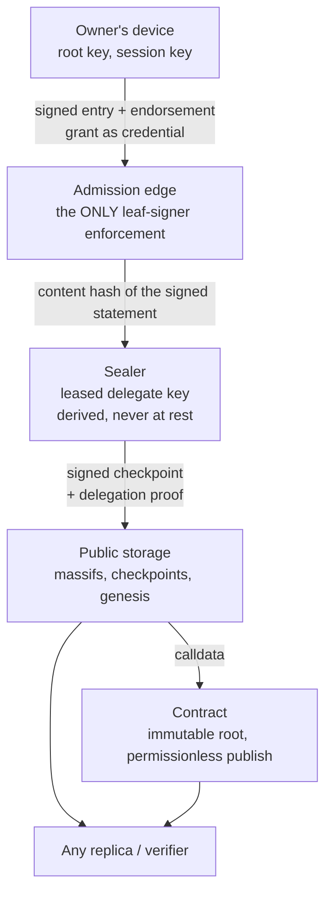

# Trust boundaries, and what the operator can and cannot do

**Audience:** relying parties, security reviewers, and anyone assessing what
trusting a Forestrie operator would actually mean.
**Related:** [receipt-trust-model.md](./receipt-trust-model.md),
[key-custody-and-choice.md](./key-custody-and-choice.md),
[glossary.md](../glossary.md).

## Summary

Forestrie's design goal is not that the operator is honest. It is that the
operator's honesty **does not need to be assumed** for the record to mean
something. This document states where the boundaries are, what crosses them,
what an operator can still do, what it cannot do, and what it can do that is
not prevented.

The short version: an operator can **decline to act**, and that is visible. It
cannot forge an entry, re-root a log, or mint authority for a key the owner
never authorised. What a key the owner *did* authorise can do is bounded by
the contract as deployed, and §4.1 states that bound exactly, because the
strongest guarantee here — non-equivocation — holds structurally against
outsiders and only observationally against a holder of the log's own signing
authority.

## 1. The parties

Two distinct operators are routinely collapsed into one, and the distinction is
load-bearing for some attacks (§5).

| Party | Role | Holds |
|---|---|---|
| **The log owner** (user) | Holds the log root key | The root key, in one of the custody shapes |
| **Transparency operator** — admission edge | Sequences entries, enforces who may sign one | No private keys authoritative for any log |
| **Transparency operator** — sealer | Signs checkpoints under an issued lease | A standing delegated sealing key, derived at boot from a KMS-held seed and never persisted at rest; one key serves every log that has leased it |
| **Transparency operator** — publisher | Chooses which sealed checkpoints to submit, and pays gas | A gas key. No authority |
| **Transparency operator** — custodian | Holds the KMS custody keys for custodial logs | One KMS key per custodial log id. **For a custodial log this key is the log's root key**: it signs the delegation certificate and the on-chain proof, and it signs any digest a caller presents under one shared service token |
| **Hosting operator** | Onboards and hosts, collects payment, routes signing requests | Its own operator keys. Never a user root in the self-custody shapes; in the hosted-wallet shape, an additional signer within policy |
| **Enclave provider** | Optional signing backend for the hosted-wallet custody option | In that option only, the user-owned wallet key |
| **The upgrade admin** | Exists only for the upgradeable contract variant | A single address that can replace the contract's code, and with it every rule below (§4.2) |
| **The contract** | Anchors roots, accepts checkpoints | On-chain state; no secrets |
| **Anyone** | Replicates, verifies, publishes | Public data — which is sufficient |

## 2. The boundaries, and what crosses them

The crossings that matter:

- **Owner → edge.** The signed entry, carrying its own endorsement, plus the
  grant as credential. This boundary is the only place leaf-signer authority is
  enforced. The edge receives the **whole signed statement**, because it has
  to verify the signature; what it forwards to sequencing is the statement's
  content hash.
- **Edge → everything downstream.** Only **content hashes** cross. Statement
  bytes are not persisted server-side. That is a **retention policy** the
  operator applies at the edge, not a property of the construction: a relying
  party trusts it as they would any other statement about what an operator
  does not keep. It is what keeps neutrality and custody of regulated data
  with the customer, and an operator that did hold content would reintroduce
  the trusted intermediary the system exists to remove.
- **Sealer → storage → chain.** Signed commitments only, each verifiable
  against material the owner authorised.
- **Storage → anyone.** Public and unauthenticated for reads. This is the
  crossing that makes the operator optional: a replica is a complete
  verification substrate, not a cache.

## 3. What the operator can do

These are real capabilities, stated without softening. A threat model that lists
only defeats is incomplete.

| Capability | Bound |
|---|---|
| **Refuse admission** of a well-formed entry | Real censorship at the edge. Detectable by the client immediately, but not preventable |
| **Append a leaf no statement backs** | The sequencer takes a content hash and never sees a statement; it can append hashes of its own. Such a leaf fails attribution for anyone who asks, and consumes the log's capacity |
| **Assign idtimestamps from its own clock, and fix entry order** | The idtimestamp is the operator's clock reading; it is what the offline endorsement window is checked against. Ordering within a log is the sequencer's choice |
| **Stop sealing, or delay it indefinitely** | The log stops advancing. Visible as anchor lag; nothing bounds how long it may persist. The owner's remedy is to delegate a different sealer |
| **Re-seal a massif** | Routine: each seal of a growing massif replaces the checkpoint object with one from the same boundary. A retained earlier checkpoint stays valid |
| **Sign checkpoints within a lease** | On-chain: bounded to the leased log and its inclusive MMR range, until the log grows past the range's end — **there is no on-chain expiry**. Off-chain: the certificate's expiry bounds when verifiers accept it. Consistency with the anchored state is enforced for every proof whose base is non-zero; §4.1 states the exception |
| **Decide what reaches the chain** | The publisher selects which sealed checkpoints it submits, and when. It cannot alter them, and anyone else may submit one it withholds |
| **Withhold or delay data it serves** | Anyone holding a replica is unaffected; a party depending solely on the operator's endpoints is |
| **Withhold a grant before its first anchor** | Until a log's first checkpoint is anchored, its grant exists only in the operator's grant store; the operator can withhold it, and nothing public proves it was issued |
| **Sign anything with a custody key** | For custodial logs the custodian signs any digest presented under the service token: a general signing oracle over every custody key it holds |
| **Observe metadata** | Entry sizes, timing, and volume are visible even though content is not |
| **Decline to renew capacity** | Forward-only. It cannot revoke what is already committed |

The sealing key is the one hot-path private key the sealer holds. It exists
only because an owner's root signed a lease naming **that specific key**,
scoped by log and MMR range, and no long-lived private key is persisted at
rest. It is **derived, not generated-and-discarded**: an HKDF over a seed the
operator's KMS re-derives at boot, keyed by an epoch and an index and by
nothing log-specific, so a restart re-derives the *same* key and one key
serves every log that has leased it. What bounds a compromise is therefore
the set of leases the key holds, not the key's lifetime. A lease cannot be cut
short by the owner: there is no on-chain expiry, and no root rotation. The
derivation is set out in [receipt-trust-model.md](./receipt-trust-model.md)
(question 2).

## 4. What the operator cannot do

| Cannot | Why |
|---|---|
| **Forge an entry** | Entry signer authority is enforced against the grant's binding — the owner's key, or a session key that key endorsed. The operator has neither, in the self-custody shapes |
| **Re-root a log** | The root is bound once and immutable. There is no re-rooting operation for anyone, including the owner |
| **Rewrite committed history without a key the owner authorised** | Every consistency proof whose base is non-zero is folded from the anchored accumulator, and the claimed size must strictly increase. Without a checkpoint-signing key the contract accepts, no history can be replaced |
| **Present two histories to a chain reader without a key the owner authorised** | The same fold. §4.1 states what a key holder can do |
| **Mint authority** | Authority is a grant inclusion proof plus a correctly signed receipt. There is no operator-issued credential anywhere in the model |
| **Block a publish** | Submission is permissionless — the contract does not check the sender. Anyone can publish a well-formed checkpoint |
| **Exceed a lease on-chain** | The log and the inclusive MMR range are checked on-chain at publish. Expiry is not; it is a certificate property |
| **Extract a user root** | In the self-custody shapes it never holds one. In the custodial shape the custody key *is* the root and the custodian holds it |
| **Make verification depend on itself** | Verification is pure over bytes; a network call inside verify is prohibited, not merely discouraged |

The last row is the load-bearing one: every other guarantee depends on being
checkable without asking the operator.

### 4.1 Non-equivocation: structural against outsiders, observational against a key holder

At publish the contract checks, in this order: that the checkpoint's claimed
size is greater than the size it holds; that each consistency proof whose
declared base is non-zero folds from the accumulator it holds; that the
resulting peak count matches the claimed size; that the checkpoint signature
verifies over the resulting accumulator under the log's root key or a
delegated key in range; and that the presented grant is included in the owner
log. A checkpoint that fails any of these is refused. Against anyone who does
not hold a key the owner authorised, split-view protection is therefore
structural: there is no way to anchor a second history.

The contract does **not** require the first proof's declared base to equal
the size it holds. A first proof whose base is **zero** is folded from the
caller's own peaks, not from the anchored accumulator. A holder of the log's
root key, or of a delegated sealing key whose range covers the claimed size,
can therefore publish a checkpoint that replaces the anchored accumulator
with one that does not extend it, at any size greater than the current one.
The replaced history is not shorter, and it is signed by a key the owner
authorised, but it is not a prefix-consistent extension of what was anchored.

Against that party, non-equivocation is **observational**: anyone who retained
an earlier checkpoint detects the replacement, because a retained chain whose
next link's base does not equal the previous link's sealed size is refused
([receipt-trust-model.md](./receipt-trust-model.md), the checkpoint chain
root). Monitors that retain checkpoints are therefore a security dependency
for that one case, and a convenience for every other.

The glossary's "delegation lockout" entry describes the same capability from
the owner's side: a validly delegated key can publish a fork the owner's true
history no longer extends.

### 4.2 The upgrade admin

The contract is deployed in two variants. `ImutableUnivocity` has no admin and
no upgrade path; every claim in this document about the contract is a claim
about that variant. `UUPSUnivocity` is a proxy whose implementation a single
address may replace, with no timelock and no operation to transfer the
role. An upgrade can change or remove every rule described here. Where a
forest is anchored to the upgradeable variant, its genesis document says so,
and a relying party's trust in the contract's rules is trust in that address.

## 5. Adversary analysis

| Adversary | Capability | Bounded by |
|---|---|---|
| **Compromised transparency operator** | Holds the standing sealing key and every lease it carries; runs the admission edge | Signs only for logs that leased the key, within each lease's MMR range. Cannot mint authority for an unauthorised key or log, cannot obtain a self-custodied root. Can censor at admission, append unbacked leaves, and — within a lease — replace the anchored accumulator (§4.1), which retained checkpoints detect. Not neutralised by the owner: a lease runs until the log grows past its range |
| **Compromised custodian** | Holds the KMS custody keys | For every custodial log, holds the root: can delegate, sign proofs, and sign any digest. Bounded only by the owner's choice of a self-custody shape |
| **Compromised hosting operator** | Controls hosting, routes signing requests; in the hosted-wallet option is an additional signer | Cannot sign at all in the user-operated option. In the hosted-wallet option, signs within the wallet's policy while both enable bits are set; the two-bit stop is a coordinator feature, not something any contract or verifier checks. Cannot change owners, export or rotate the user's key |
| **Compromised enclave provider** | Controls the enclave | Out of scope unless the user chose that option. Where chosen, can abuse the root — mitigated only by exit, not by revocation |
| **Script injection in the owner's page, passkey root** | Can ask the session key to sign | Can attest turn content while the page is open. Cannot steal either key, re-root, extend authority, or persist beyond the session: every root signature costs a gesture |
| **Script injection in the owner's page, software root** | Can ask the root key to sign | Can obtain a root-signed delegation certificate and on-chain proof with a caller-chosen certificate expiry and no on-chain expiry, and a root-signed grant, which is permanent. The residual protection is that the key is non-extractable: the attacker can use it while the page is open but cannot take it. That protection is client-side, and no server can enforce it |
| **Network / replay** | Replays artifacts | Delegations bound by log and range; certificates by expiry and id; endorsements by their window. A sealed grant is public and replayable by design — presenting it conveys nothing — and only a not-yet-sealed creation grant acts as a credential |
| **Another tenant** | Cross-log abuse | Everything is log-scoped: certificates bind a log id, grants bind logId and ownerLogId, leases bind an MMR range |
| **A malicious publisher** | Submits transactions | Pays gas and gains nothing. Publishing is permissionless precisely because it confers no authority |
| **The upgrade admin** (upgradeable variant only) | Replaces the contract implementation | Nothing on-chain. Every rule above is subject to that address |

**What needs collusion.** Forging an entry in a self-custodied log needs the
owner's key, which no operator holds: that is not reachable by collusion at
all. Rewriting a self-custodied log's anchored history needs a lease the owner
issued, which the transparency operator's sealer holds alone. Silently
attesting content in a passkey-rooted log needs the page, alone. Suppressing
a log entirely — refusing admission *and* withholding its data *and* never
sealing — needs the admission edge, the storage and the sealer, which one
transparency operator runs together. The distinction between the two
operators bounds the hosted-wallet shape: signing there needs the hosting
operator's signer *and* the wallet's policy to permit it, and abusing the root
outright needs the enclave provider.

## 6. The limits

Limits a careful reader should hold against this design.

**Censorship at admission is real.** The edge can refuse a well-formed entry.
The client sees the refusal immediately, so this is *detectable* rather than
*preventable* — the owner's remedy is to take their log elsewhere, which the
exit path makes possible without cooperation. But nothing stops the refusal.

**A lease cannot be revoked.** Once the owner has signed a delegation, the
sealer it names can publish for that log within the range until the log
grows past it. The owner can delegate another sealer alongside; they cannot
shorten what they issued.

**Absence is provable, succinctly is not.** Non-presence can be proven against
a replicated log. A *succinct* absence proof needs an authenticated secondary
index, which needs the exclusion trie's root to be anchored; neither exists,
as [implementation-status.md](./implementation-status.md) records. Do not
design against succinct absence as though it were available.

**Offline verification is not finality.** Layers A–C
([checkpoints-and-receipts.md](./checkpoints-and-receipts.md) §4) prove
inclusion in a sealed state. Whether that state is anchored on-chain is a separate question
answered by reading the chain. A user interface that merges "verified" and
"final" is overstating.

**The off-chain authority walk is a route, not a guarantee.** Authority
reaches the anchor on-chain, or off-chain as far as a certificate reaches, or
off-chain by the walk from grant records — see
[receipt-trust-model.md](./receipt-trust-model.md) (question 3) for what each
answers, and [implementation-status.md](./implementation-status.md) for which
verifiers implement the walk.

**In-page compromise can attest content.** Accepted and retained: the passkey
gates authorisation, not per-turn content. A design where every turn needed a
gesture would be honest about content and unusable in practice. Under a
software root the same compromise reaches authorisation too (§5).

**Metadata is not private.** Content stays with the customer; sizes, timing and
volume do not. What the edge does not retain is a policy, not a proof.

**The hosted custody option trusts an enclave**, and the custodial option
trusts the operator's KMS outright. Those residuals are why the self-custody
options exist, and they should be stated to users rather than implied.

**The upgradeable variant trusts one address.** See §4.2.

**Some invariants are held by convention.** One grant-flag band is reserved
by comment alone ([label-registry.md](./label-registry.md) §5), and several
constants must agree across repositories; where only comments enforce that,
[implementation-status.md](./implementation-status.md) says so.

## Open questions

- **Anchor lag has no owner-facing guarantee.** The operator's failure to seal
  is visible, but nothing bounds how long it may persist before the owner is
  entitled to act.
- **How to anchor the exclusion trie root**, which is what would make succinct
  absence possible.

## References

- [receipt-trust-model.md](./receipt-trust-model.md) — the four questions a
  receipt answers, and the trust roots that answer them.
- [key-custody-and-choice.md](./key-custody-and-choice.md) — the custody options
  referenced throughout, including the BYOK modes and the exit path.
- [checkpoints-and-receipts.md](./checkpoints-and-receipts.md) — why anyone can
  mint a receipt.
- [rules/platform.md](../rules/platform.md) — the invariants these boundaries
  hold up.
